# AI Distributor Ordering Platform — End-to-End UML

Visual architecture and behavior models for the full platform.  
PlantUML sources: [`uml/plantuml/`](uml/plantuml/) · Render with [PlantUML](https://plantuml.com/) or VS Code PlantUML extension.

---

## 1. System Context (C4 Level 1)

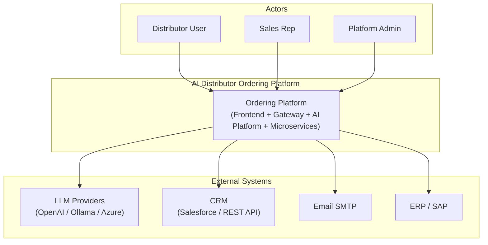

---

## 2. Container Diagram (C4 Level 2)

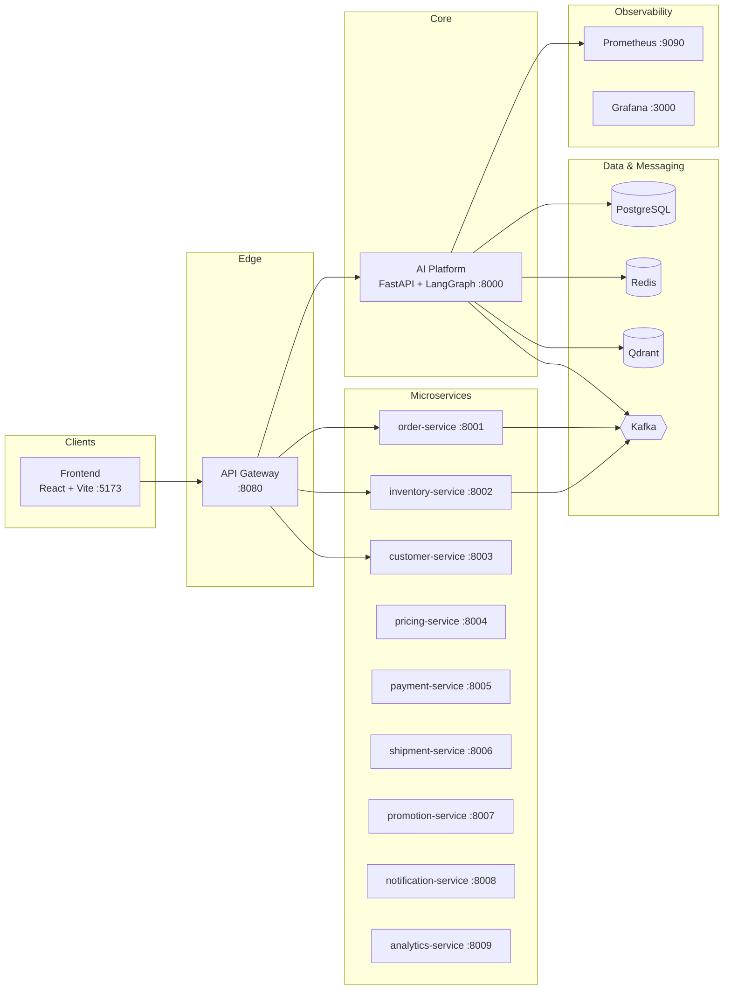

---

## 3. Clean Architecture Layers

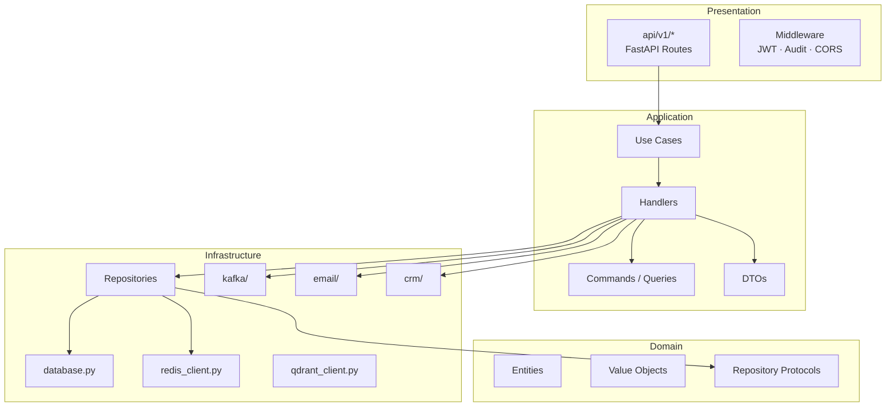

---

## 4. Application Layer — Class Diagram (CQRS)

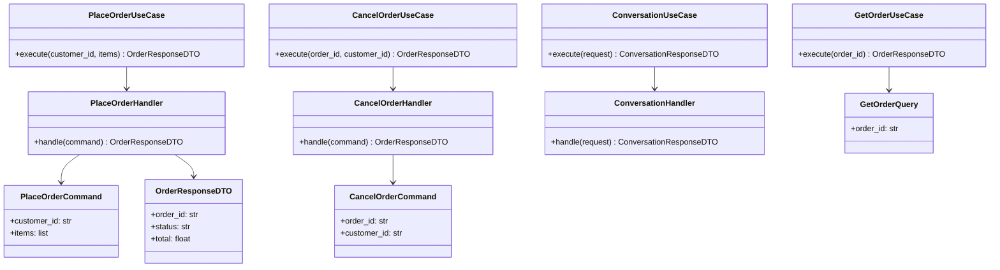

---

## 5. LangGraph Orchestrator — Activity Diagram

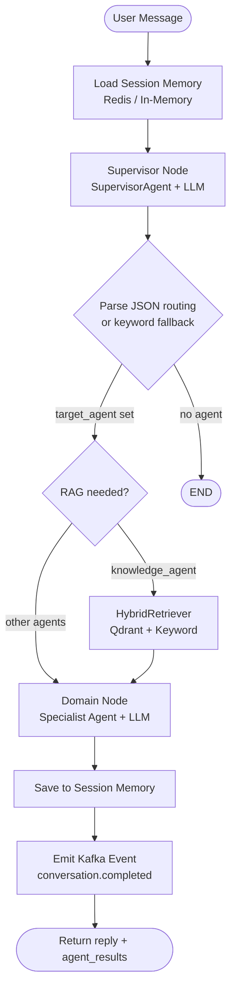

---

## 6. Sequence — Conversation (End-to-End)

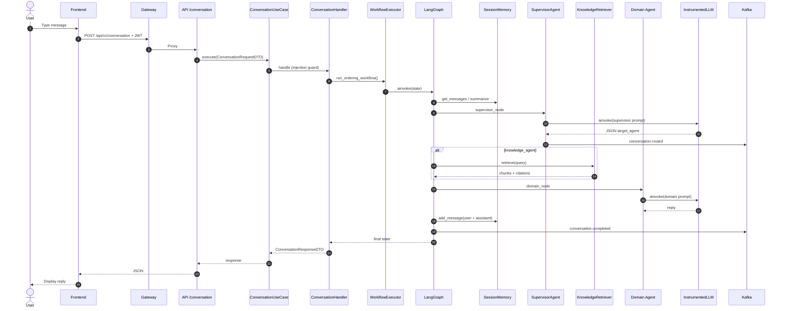

---

## 7. Sequence — Place Order (End-to-End)

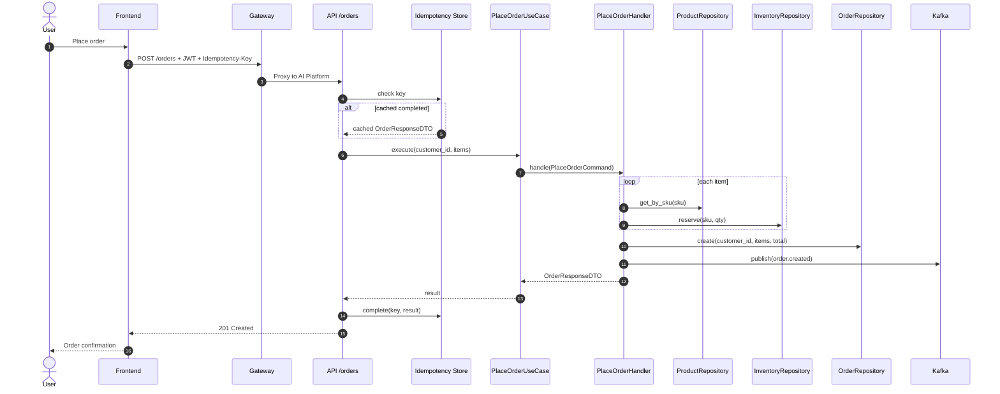

---

## 8. Sequence — Cancel Order

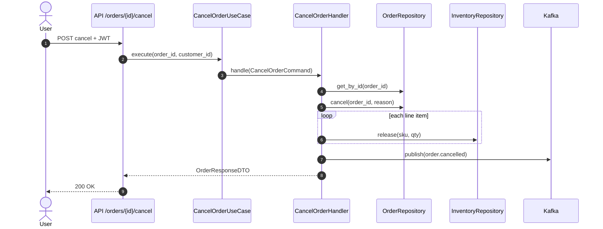

---

## 9. Sequence — Platform Startup (Infrastructure)

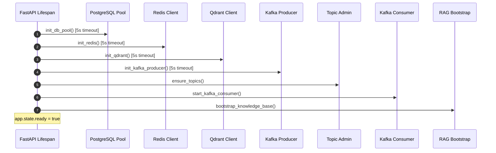

---

## 10. Infrastructure Component Diagram

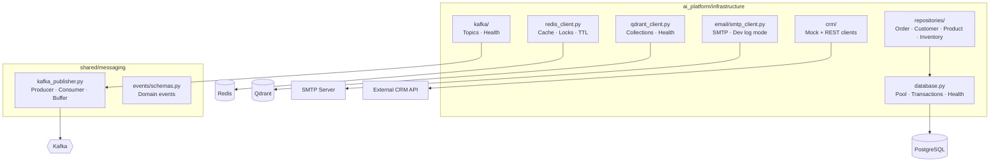

---

## 11. Order State Machine

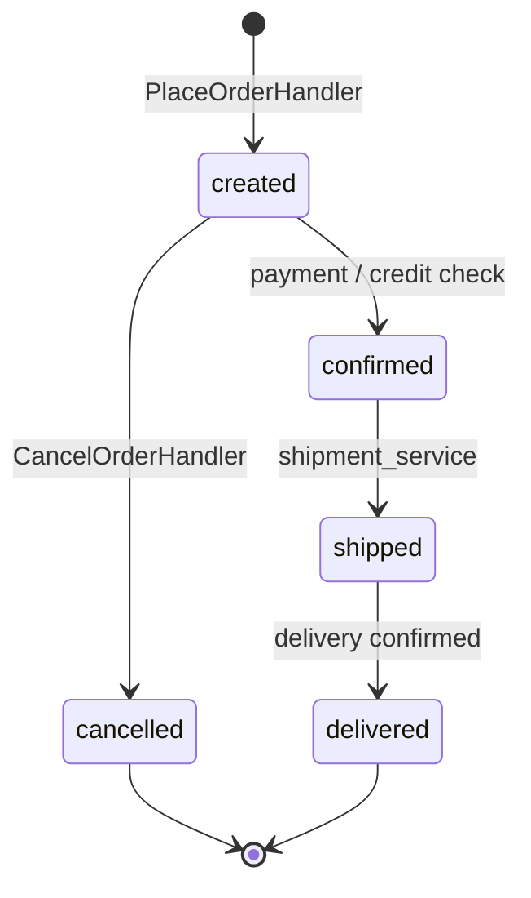

---

## 12. Deployment Diagram (Docker Compose)

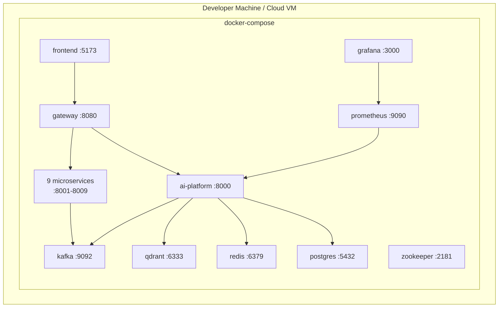

---

## 13. Agent Ecosystem

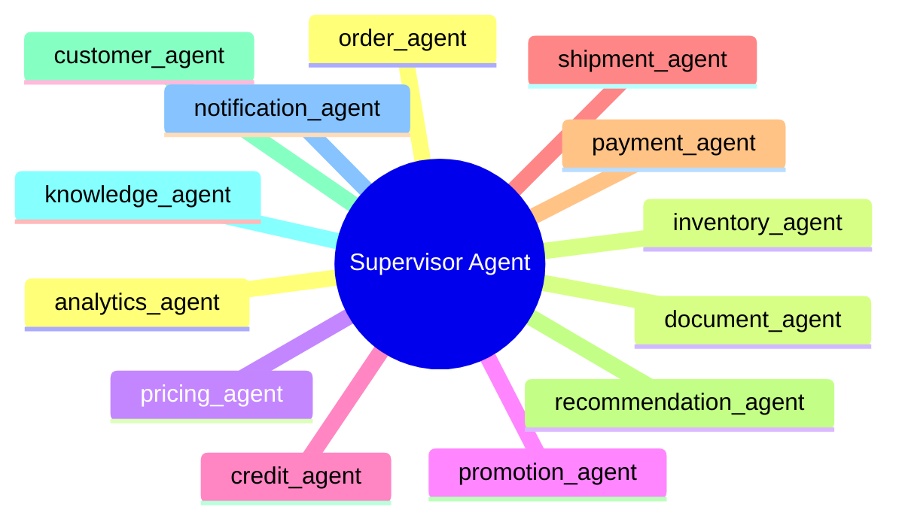

---

## File Index

| File | UML Type | Description |
|------|----------|-------------|
| [`uml/plantuml/01-system-context.puml`](uml/plantuml/01-system-context.puml) | C4 Context | Actors and external systems |
| [`uml/plantuml/02-container.puml`](uml/plantuml/02-container.puml) | C4 Container | Services and data stores |
| [`uml/plantuml/03-component-ai-platform.puml`](uml/plantuml/03-component-ai-platform.puml) | Component | AI platform internal modules |
| [`uml/plantuml/04-class-application.puml`](uml/plantuml/04-class-application.puml) | Class | CQRS application layer |
| [`uml/plantuml/05-class-infrastructure.puml`](uml/plantuml/05-class-infrastructure.puml) | Class | Infrastructure clients |
| [`uml/plantuml/06-sequence-conversation.puml`](uml/plantuml/06-sequence-conversation.puml) | Sequence | AI conversation E2E |
| [`uml/plantuml/07-sequence-place-order.puml`](uml/plantuml/07-sequence-place-order.puml) | Sequence | Order placement E2E |
| [`uml/plantuml/08-sequence-cancel-order.puml`](uml/plantuml/08-sequence-cancel-order.puml) | Sequence | Order cancellation |
| [`uml/plantuml/09-sequence-startup.puml`](uml/plantuml/09-sequence-startup.puml) | Sequence | Lifespan / infra init |
| [`uml/plantuml/10-activity-orchestrator.puml`](uml/plantuml/10-activity-orchestrator.puml) | Activity | LangGraph routing flow |
| [`uml/plantuml/11-state-order.puml`](uml/plantuml/11-state-order.puml) | State | Order lifecycle |
| [`uml/plantuml/12-deployment.puml`](uml/plantuml/12-deployment.puml) | Deployment | Docker Compose topology |

### Render PlantUML

```bash
# Install PlantUML, then:
plantuml uml/plantuml/*.puml -o ../output
```

Or use the VS Code **PlantUML** extension: open any `.puml` file and press `Alt+D` to preview.

---

*AI Distributor Ordering Platform · UML v1.0 · July 2026*
