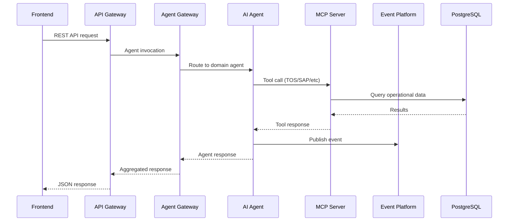

# Smart Port AI Platform — Architecture

## Overview

The Smart Port AI Platform is a cloud-native, event-driven architecture designed for port digital transformation. It integrates terminal operating systems, enterprise ERP, customs authorities, and IoT sensor networks through a unified multi-agent AI layer.

## Design Principles

1. **Agent-First Operations** — Domain-specific AI agents handle operational queries and actions
2. **MCP Integration** — Model Context Protocol servers provide standardized enterprise connectivity
3. **Event-Driven** — Kafka-based event streaming for real-time operational awareness
4. **RAG-Enhanced** — Retrieval-augmented generation for port documentation and SOPs
5. **Predictive ML** — ML models for delay prediction, congestion, and revenue forecasting
6. **Zero-Trust Security** — OAuth2/OIDC, RBAC, audit logging, secrets management

## Component Interaction

## Technology Stack

| Layer | Technology |
|-------|-----------|
| Frontend | React 18, Vite, TanStack Query, Recharts |
| Gateways | NestJS, TypeScript, JWT |
| Agents | Python, FastAPI, LangGraph, LangChain |
| MCP Servers | Python, MCP SDK |
| ML | scikit-learn, FastAPI |
| RAG | pgvector, OpenAI Embeddings |
| Events | Apache Kafka, Schema Registry |
| Data | PostgreSQL 16, Redis, Elasticsearch, BigQuery |
| Observability | Prometheus, Grafana, OpenTelemetry |
| Deployment | Docker, Kubernetes, Helm, Terraform, Cloud Run |

## Scalability

- API Gateway: HPA 2–10 replicas
- Agents: Independent scaling per domain
- Kafka: 3+ broker cluster with topic partitioning
- PostgreSQL: Cloud SQL with read replicas
- ML Services: Scale-to-zero on Cloud Run

## Security Model

- Authentication: JWT (local), Okta SSO, Azure AD
- Authorization: RBAC with domain-specific permissions
- Audit: All agent invocations and data access logged
- Secrets: Azure Key Vault / GCP Secret Manager
- Network: Private VPC, mTLS between services
