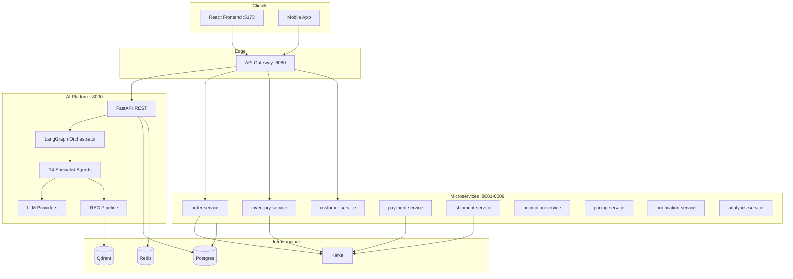

# Architecture Overview

The AI Distributor Ordering Platform is a B2B ordering system that combines **LangGraph multi-agent AI**, **event-driven microservices**, and a **React web frontend**.

## Design Principles

1. **Clean Architecture** — strict separation of presentation, application, domain, and infrastructure layers
2. **Event-driven** — services communicate asynchronously via Kafka domain events
3. **AI-first** — LangGraph orchestrator routes natural-language requests to 14 specialist agents
4. **Security by default** — JWT on all protected endpoints, RBAC, prompt-injection guards, PII masking
5. **Observable** — structured logging, Prometheus metrics, OpenTelemetry tracing (optional)

## System Context



## Layer Model

| Layer | Location | Responsibility |
|-------|----------|----------------|
| **Presentation** | `frontend/`, `gateway/`, `api/v1/` | HTTP, UI, routing, auth middleware |
| **Application** | `application/use_cases/`, `commands/`, `dto/` | Use cases, orchestration, DTOs |
| **Domain** | `domain/*/` | Entities, repository interfaces, domain services |
| **Infrastructure** | `infrastructure/`, `shared/` | DB, Kafka, Redis, external adapters |

## Key Components

### AI Platform (`ai-platform/ai_platform/`)

The core service. Handles AI conversation, product catalog, and can serve orders directly when microservices are unavailable (in-memory/Postgres fallback).

- **14 agents** — each handles one business domain
- **LangGraph orchestrator** — supervisor routes to specialist agents
- **RAG** — knowledge retrieval from Qdrant (with in-memory fallback)
- **LLM layer** — OpenAI, Ollama, Azure OpenAI providers

### API Gateway (`gateway/`)

Single entry point for clients. Validates JWT, routes requests to AI platform or microservices.

### Microservices (`services/`)

Nine independently deployable domain services, each with health/ready/metrics endpoints.

### Shared Library (`shared/`)

Cross-cutting Python modules: config, logging, security, exceptions, messaging, telemetry.

### Frontend (`frontend/`)

React + TypeScript + Vite web application with login, dashboard, AI chat, orders, products, and inventory pages.

## LangGraph Flow

```
User message
    │
    ▼
supervisor_node ──► route() keyword/LLM routing
    │
    ▼
domain_node ──► specialist agent (order, inventory, pricing, …)
    │
    ▼
Response + Kafka event (conversation.completed)
```

## Data Stores

| Store | Purpose | Port |
|-------|---------|------|
| PostgreSQL | Orders, customers, products, inventory | 5432 |
| Redis | Session memory, caching, idempotency (planned) | 6379 |
| Qdrant | RAG vector knowledge base | 6333 |
| Kafka | Domain events between services | 9092 |

## Security Model

- **JWT** (HS256) on all `/api/v1/*` endpoints except `/health`, `/metrics`, `/auth/token`
- **RBAC** — roles: `admin`, `sales_rep`, `distributor`, `viewer`
- **Prompt injection** guard on `/conversation`
- **PII masking** in structured logs
- **Idempotency-Key** header on POST mutations (orders, payments)

## Related Documents

- [System Design](system-design.md) — detailed component breakdown
- [REST API](../api/rest-api.md) — endpoint reference
- [ADR-001](../ADR/001-clean-architecture.md) — architecture decision record
