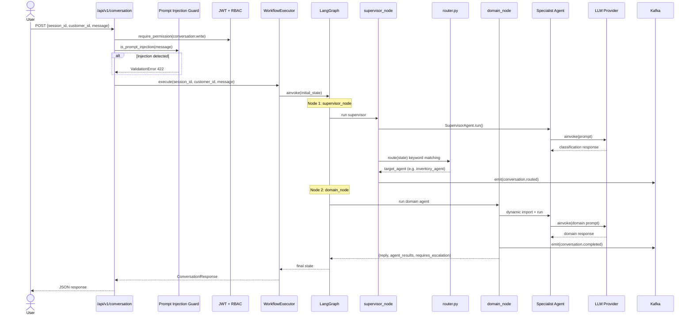

# Conversation Flow Sequence Diagram

How the LangGraph orchestrator processes AI conversation requests.

## Full Conversation Flow



## Agent Routing Keywords

| Agent | Trigger Keywords |
|-------|-----------------|
| order_agent | order, place, buy, purchase |
| inventory_agent | stock, inventory, available, availability |
| pricing_agent | price, quote, cost, rate |
| promotion_agent | promotion, discount, offer, deal |
| credit_agent | credit, limit, terms, payment terms |
| shipment_agent | ship, track, delivery, logistics |
| payment_agent | pay, payment, invoice, balance |
| recommendation_agent | recommend, suggest, alternative |
| customer_agent | account, profile, customer |
| knowledge_agent | help, faq, how to, policy |
| *(default)* | customer_agent |

## Graph Structure

```
START → supervisor_node → domain_node → END
```

Defined in `ai-platform/ai_platform/orchestrator/graph.py`.

## State Schema

```python
class OrchestratorState(TypedDict):
    session_id: str
    customer_id: str
    message: str
    target_agent: str | None
    agent_results: list[dict]
    reply: str | None
    requires_escalation: bool
```

## Escalation

When an agent sets `requires_escalation: true`, the frontend should notify the user that human intervention may be needed. This is used for complex credit decisions, disputed orders, or low-confidence responses.
