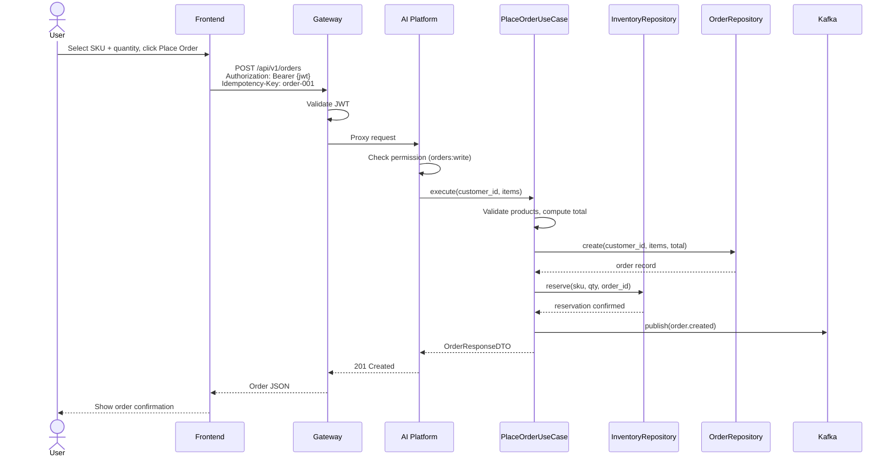
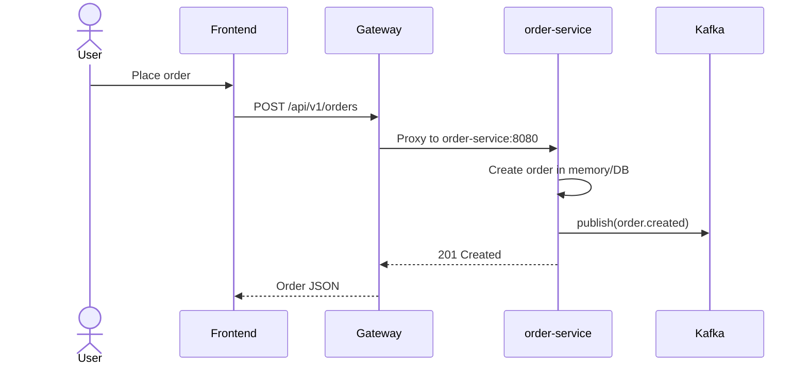
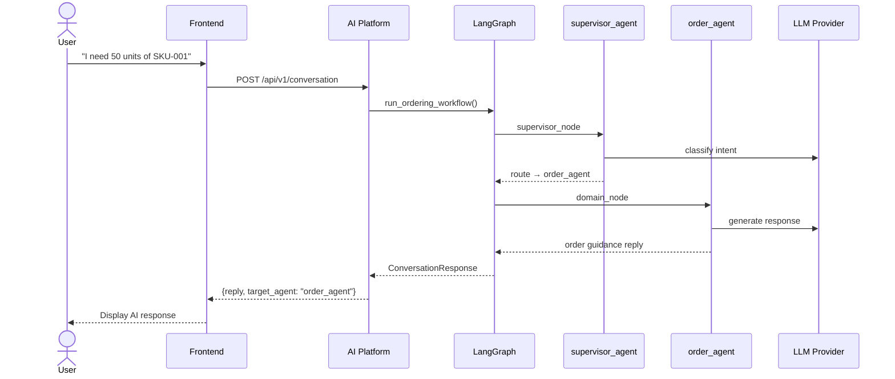

# Order Flow Sequence Diagram

End-to-end flow for placing a distributor order.

## Manual Order (REST API)



## Via Gateway to Order Microservice

When the full Docker stack is running, orders route to `order-service`:



## AI-Assisted Order



## Order Status Lifecycle

```
created → confirmed → shipped → delivered
                  ↘ cancelled
```

Status constants defined in `shared/constants/status.py`.
