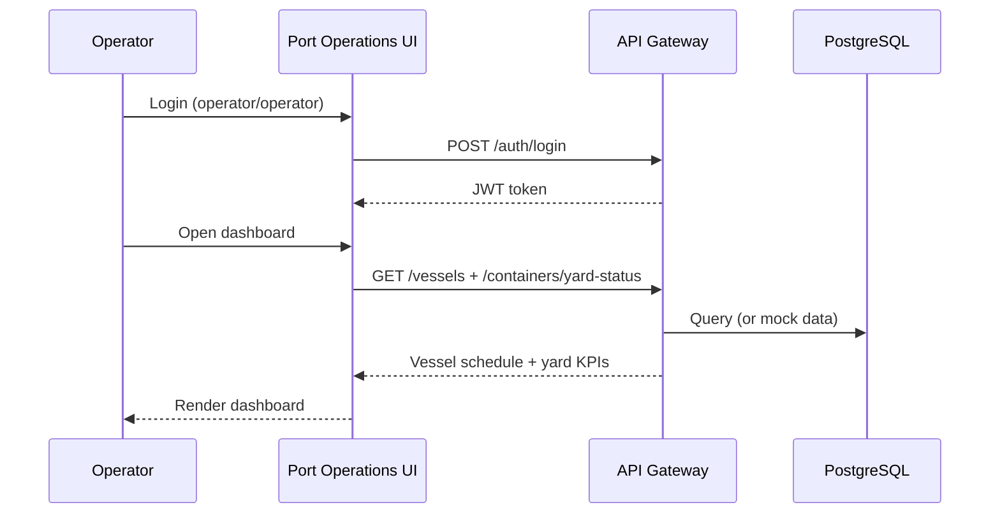
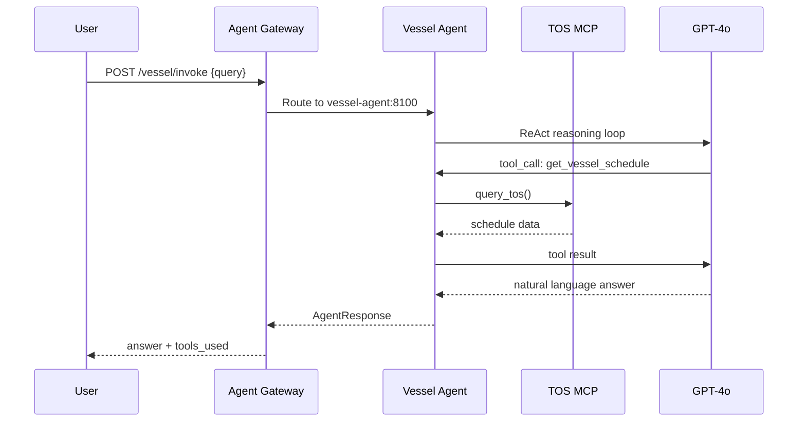
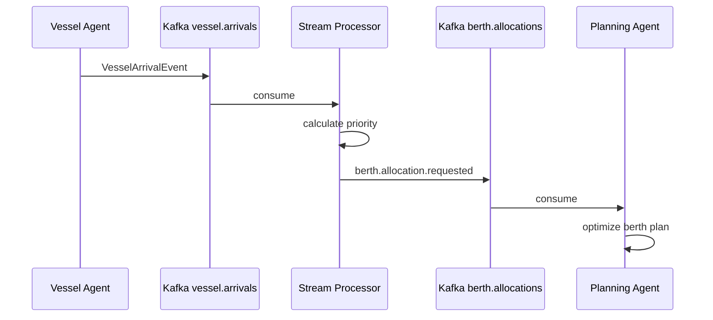

# Smart Port AI Platform — End-to-End Design (UML)

This document is the master index for all UML design artifacts. Source files live in [`docs/uml/`](./uml/).

## Design Overview

The Smart Port AI Platform follows a **layered, event-driven, agent-first** architecture:

```
┌─────────────────────────────────────────────────────────────────┐
│  PRESENTATION    │ 4 React apps (Port Ops, Executive, Customs, Mobile) │
├──────────────────┼──────────────────────────────────────────────────────┤
│  GATEWAY         │ API Gateway (REST)  │  Agent Gateway (AI routing)   │
├──────────────────┼──────────────────────────────────────────────────────┤
│  INTELLIGENCE    │ 11 LangGraph Agents │ RAG (6) │ ML (7)              │
├──────────────────┼──────────────────────────────────────────────────────┤
│  INTEGRATION     │ 12 MCP Servers → TOS, SAP, Customs, AIS, etc.        │
├──────────────────┼──────────────────────────────────────────────────────┤
│  EVENTS          │ Kafka topics, streams, schemas, dead-letter queues   │
├──────────────────┼──────────────────────────────────────────────────────┤
│  DATA            │ PostgreSQL/pgvector, Redis, Elasticsearch, BigQuery  │
├──────────────────┼──────────────────────────────────────────────────────┤
│  CROSS-CUTTING   │ Security (OAuth2, RBAC), Observability, Deployment   │
└─────────────────────────────────────────────────────────────────┘
```

## UML Artifact Catalog

### Structural Diagrams

| Diagram | File | Description |
|---------|------|-------------|
| System Context (C4 L1) | `uml/01-system-context.puml` | Actors, external systems, platform boundary |
| Container (C4 L2) | `uml/02-container-diagram.puml` | Runtime containers and data stores |
| Component | `uml/03-component-diagram.puml` | Gateway modules, agent internals, MCP |
| Deployment | `uml/04-deployment-diagram.puml` | GKE, Cloud SQL, Kafka, GCS production layout |
| Package | `uml/17-package-diagram.puml` | Monorepo module dependencies |
| Security Component | `uml/18-component-security.puml` | Auth, RBAC, audit, secrets |

### Behavioral Diagrams

| Diagram | File | Description |
|---------|------|-------------|
| Use Case | `uml/05-use-case-diagram.puml` | 22 use cases across 6 actor types |
| Domain Class | `uml/06-domain-class-diagram.puml` | Core entities and relationships |
| Sequence: Auth | `uml/07-sequence-authentication.puml` | JWT login and SSO |
| Sequence: Agent | `uml/08-sequence-agent-invoke.puml` | Single-agent LangGraph flow |
| Sequence: Orchestration | `uml/09-sequence-orchestration.puml` | Multi-agent workflow |
| Sequence: RAG | `uml/10-sequence-rag-pipeline.puml` | Ingestion and vector retrieval |
| Sequence: ML | `uml/11-sequence-ml-prediction.puml` | Model inference pipeline |
| Sequence: Events | `uml/12-sequence-event-flow.puml` | Kafka publish/consume/DLQ |
| Activity: Vessel | `uml/13-activity-vessel-arrival.puml` | End-to-end vessel arrival |
| Activity: Customs | `uml/14-activity-customs-clearance.puml` | Clearance decision workflow |
| State: Vessel Call | `uml/15-state-vessel-call.puml` | scheduled → departed lifecycle |
| State: Declaration | `uml/16-state-customs-declaration.puml` | pending → cleared lifecycle |

## End-to-End Request Flows

### Flow 1: Operator views dashboard



### Flow 2: AI agent answers operational query



### Flow 3: Event-driven berth allocation



## Domain Model Summary

| Entity | Key States / Attributes |
|--------|------------------------|
| Vessel | scheduled, approaching, berthed, departed |
| VesselCall | ETA, ETD, ATA, ATD, berth assignment |
| Container | available, in_transit, held, customs_hold |
| CustomsDeclaration | pending, in_review, cleared, held, rejected |
| Invoice | draft, pending, paid, overdue |
| Document / Chunk | pgvector embeddings for RAG |

## Agent Registry

| Key | Agent | Port | Domain Tools |
|-----|-------|------|--------------|
| vessel | vessel-agent | 8100 | schedule, berth, ETA, weather |
| container | container-agent | 8101 | status, stacking, find, moves |
| customs | customs-agent | 8102 | clearance, declaration, risk |
| billing | billing-agent | 8103 | charges, invoice, tariff |
| maintenance | maintenance-agent | 8104 | schedule, health, failure |
| incident | incident-agent | 8105 | detect, triage, escalate |
| planning | planning-agent | 8106 | plan, optimize, simulate |
| safety | safety-agent | 8107 | compliance, hazard, alert |
| weather | weather-agent | 8108 | forecast, impact, tide |
| logistics | logistics-agent | 8109 | gate, routes, queue |
| executive | executive-agent | 8110 | KPIs, briefing, trends |

## Render All Diagrams

```bash
# Using PlantUML Docker
docker run --rm -v "%cd%/docs/uml:/data" plantuml/plantuml -tpng /data/*.puml

# Output: PNG files in docs/uml/
```

See [`docs/uml/README.md`](./uml/README.md) for full rendering instructions.

## Traceability Matrix

| Business Capability | Use Case | Sequence | Activity | State |
|--------------------|----------|----------|----------|-------|
| Vessel operations | UC1, UC4 | 08, 12 | 13 | 15 |
| Container yard | UC2, UC3 | 08, 12 | 13 | — |
| Customs clearance | UC5–UC7 | 08, 09 | 14 | 16 |
| AI assistance | UC8, UC9 | 08, 09 | — | — |
| Knowledge search | UC10 | 10 | — | — |
| Predictions | UC11 | 11 | 13 | — |
| Executive reporting | UC12 | 09 | — | — |
| Authentication | UC19–UC21 | 07 | — | — |

---

*Smart Port AI Platform — Design Documentation v1.0.0*
