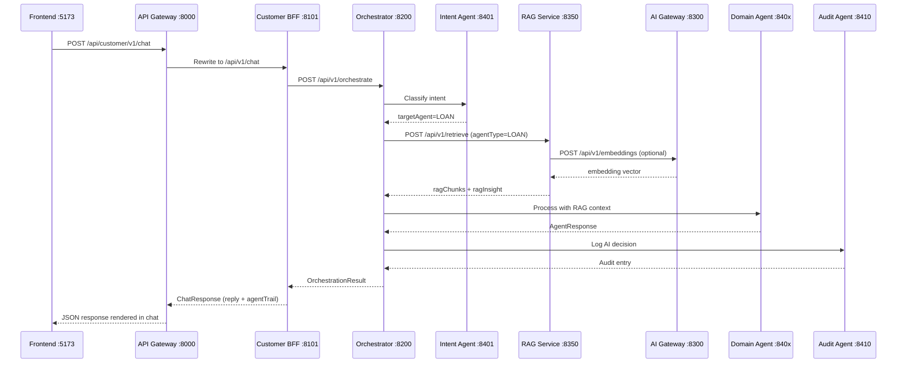
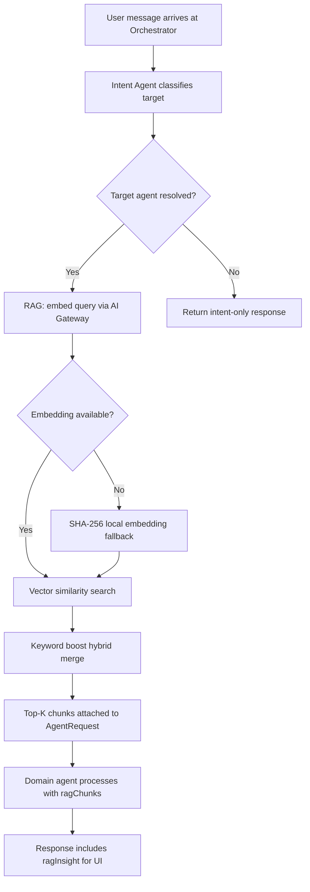
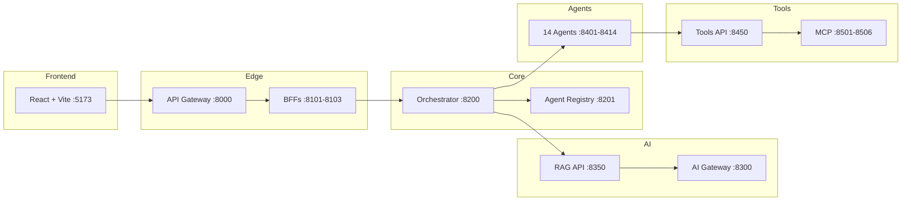

# BFSI Agentic AI Platform — User Manual

**Version:** 0.1.0-SNAPSHOT  
**Last updated:** June 2026  
**Audience:** End users, operations staff, platform administrators, and integrators

---

## Table of Contents

1. [Introduction](#1-introduction)
2. [System Overview](#2-system-overview)
3. [Prerequisites](#3-prerequisites)
4. [Installation & First-Time Setup](#4-installation--first-time-setup)
4A. [Quick Start — Frontend, Backend, AI & RAG](#4a-quick-start--frontend-backend-ai--rag)
5. [Starting and Stopping the Platform](#5-starting-and-stopping-the-platform)
6. [User Portals](#6-user-portals)
7. [AI Agents](#7-ai-agents)
8. [Orchestration Flow](#8-orchestration-flow)
9. [RAG Knowledge Service](#9-rag-knowledge-service)
10. [Tools & MCP Integration](#10-tools--mcp-integration)
11. [AI Gateway](#11-ai-gateway)
12. [API Reference](#12-api-reference)
13. [Configuration Reference](#13-configuration-reference)
14. [Infrastructure Services](#14-infrastructure-services)
15. [Observability & Monitoring](#15-observability--monitoring)
16. [Production Deployment](#16-production-deployment)
17. [Troubleshooting](#17-troubleshooting)
18. [Security & Compliance](#18-security--compliance)
19. [Frequently Asked Questions](#19-frequently-asked-questions)
20. [Glossary](#20-glossary)

---

## 1. Introduction

The **BFSI Agentic AI Platform** is an enterprise multi-agent system for Banking, Financial Services, and Insurance. It routes customer and staff requests through specialized AI agents — covering KYC, AML, fraud detection, lending, underwriting, claims, compliance, audit, portfolio advice, and more — while maintaining audit trails, regulatory context (RAG), and integration with core banking and operational tools (MCP).

### What you can do

| Persona | Primary use |
|---------|-------------|
| **Customer** | Self-service chat for loans, accounts, KYC, claims, investments |
| **Employee** | Staff-assisted workflows, case review, escalation to human teams |
| **Administrator** | Agent registry, platform health, orchestration debugging |
| **Integrator** | REST APIs via API Gateway for chat, RAG, tools, and AI completions |

### Key capabilities

- **14 domain agents** with intent-based routing
- **Retrieval-Augmented Generation (RAG)** with agent-scoped knowledge collections
- **19 MCP tools** across core banking, CRM, audit, regulatory, notifications, and ticketing
- **AI Gateway** with multi-provider routing (OpenAI, Azure OpenAI, Mock), token budgets, and caching
- **Three web portals** plus full REST API access

---

## 2. System Overview

### High-level architecture

```
┌─────────────┐     ┌─────────────┐     ┌─────────────┐
│  Frontends  │────▶│ API Gateway │────▶│     BFF     │
│  (React UI) │     │   :8000     │     │ 8101–8103   │
└─────────────┘     └─────────────┘     └──────┬──────┘
                                               │
                    ┌──────────────────────────┼──────────────────────────┐
                    ▼                          ▼                          ▼
            ┌───────────────┐          ┌───────────────┐          ┌───────────────┐
            │ Orchestrator  │          │  AI Gateway   │          │  RAG / Tools  │
            │    :8200      │          │    :8300      │          │ 8350 / 8450  │
            └───────┬───────┘          └───────────────┘          └───────────────┘
                    │
        ┌───────────┼───────────┐
        ▼           ▼           ▼
   ┌────────┐  ┌────────┐  ┌────────┐
   │ Agents │  │  RAG   │  │  MCP   │
   │8401–14 │  │ context│  │8501–06 │
   └────────┘  └────────┘  └────────┘
```

### End-to-end request flow (Frontend → Reply)

This is the path a user message takes from the React UI through AI, RAG, and agents back to the browser.



### RAG retrieval flow (inside orchestration)

RAG runs **before** the domain agent on every orchestrated request. The orchestrator enriches the agent request with retrieved knowledge.



### AI Gateway role

The AI Gateway is used in two places:

| Consumer | AI Gateway endpoint | Purpose |
|----------|---------------------|---------|
| **RAG Service** | `POST /api/v1/embeddings` | Convert query text to vectors for retrieval |
| **Agents** (future LLM calls) | `POST /api/v1/chat/completions` | Domain-specific LLM responses with agent prompts |

When no OpenAI/Azure key is configured, the gateway uses the **Mock provider** — sufficient for local development and RAG fallback embeddings.

### Component dependency map



> **Minimum to run chat with RAG:** Frontend + API Gateway + BFF + Orchestrator + Agents + AI Gateway + RAG API. MCP tools are optional (agents fall back to local logic).

### Service port map

| Service | Port | Description |
|---------|------|-------------|
| API Gateway | 8000 | Single entry point for all external API traffic |
| Customer BFF | 8101 | Customer persona API aggregation |
| Employee BFF | 8102 | Employee persona API aggregation |
| Admin BFF | 8103 | Admin persona API aggregation |
| Orchestrator | 8200 | Multi-agent workflow coordination |
| Agent Registry | 8201 | Agent metadata and discovery |
| AI Gateway | 8300 | LLM routing, embeddings, prompts, caching |
| RAG Service | 8350 | Document ingestion and retrieval |
| Search API | 8370 | Full-text search (Elasticsearch / in-memory) |
| Messaging API | 8550 | Kafka event registry and consumers |
| Tools API | 8450 | MCP tool registry and proxy |
| Intent Agent | 8401 | Intent classification and routing |
| Customer Agent | 8402 | Customer profile and accounts |
| KYC Agent | 8403 | Identity verification |
| AML Agent | 8404 | Anti-money laundering checks |
| Fraud Agent | 8405 | Fraud detection |
| Loan Agent | 8406 | Loan eligibility |
| Underwriting Agent | 8407 | Insurance underwriting |
| Claim Agent | 8408 | Claims processing |
| Compliance Agent | 8409 | Regulatory compliance |
| Audit Agent | 8410 | Audit logging |
| Recommendation Agent | 8411 | Product recommendations |
| Portfolio Agent | 8412 | Investment advisory |
| Escalation Agent | 8413 | Human handoff |
| Notification Agent | 8414 | Email/SMS notifications |
| MCP Servers | 8501–8506 | External tool integrations |
| Frontend (dev) | 5173 | React web UI |
| PostgreSQL | 5432 | Primary relational database |
| pgvector | 5433 | Vector store (production RAG) |
| Redis | 6379 | Caching (optional AI Gateway) |
| Keycloak | 8080 | Identity provider (planned) |
| Grafana | 3000 | Dashboards |
| Prometheus | 9090 | Metrics |

---

## 3. Prerequisites

### Required software

| Component | Version | Purpose |
|-----------|---------|---------|
| Java JDK | 21+ | Backend services (agents, gateway, RAG, tools) |
| Maven | 3.9+ | Build system |
| Node.js | 20+ | Frontend and MCP servers |
| Docker & Docker Compose | Latest stable | Infrastructure (databases, messaging, observability) |
| PowerShell | 5.1+ (Windows) | Platform start/stop scripts |

### Hardware recommendations

| Environment | CPU | RAM | Disk |
|-------------|-----|-----|------|
| Local development | 4 cores | 16 GB | 20 GB free |
| Production (minimum) | 8 cores | 32 GB | 100 GB SSD |
| Production (HA) | 16+ cores | 64 GB+ | 500 GB SSD |

### Network requirements

- All service ports listed above must be available locally (development) or exposed through your load balancer (production).
- Outbound HTTPS to OpenAI or Azure OpenAI if using cloud LLM providers.
- Internal connectivity between agents, orchestrator, RAG, tools, and MCP servers.

---

## 4. Installation & First-Time Setup

### Step 1 — Clone the repository

```bash
git clone <repository-url>
cd bfsi-agentic-ai-platform
```

### Step 2 — Configure environment

Copy the root environment file and adjust values as needed:

```bash
cp .env.example .env   # or copy .env if example is not present
```

At minimum, review:

- Database credentials (`POSTGRES_*`, `PGVECTOR_*`)
- AI provider keys (`OPENAI_API_KEY` or `AZURE_OPENAI_*`)
- Port assignments if defaults conflict with other software

### Step 3 — Install JDK 21 (Windows)

The platform bundles a local JDK via the setup script:

```powershell
.\scripts\setup-jdk.ps1
```

This downloads Temurin JDK 21 to `.tools\jdk-21` and imports the Maven Central certificate for SSL compatibility.

### Step 4 — Start infrastructure (optional for basic dev)

For full stack including databases, messaging, and observability:

```bash
docker compose up -d
```

> **Note:** Local development works without Docker for core agent flows. RAG defaults to in-memory vector storage. MCP tools and pgvector require their respective services.

### Step 5 — Build all Java modules

```powershell
.\scripts\build.ps1
```

Or manually:

```bash
mvn clean install -DskipTests
```

Build time is typically 3–8 minutes depending on hardware and network.

### Step 6 — Install frontend dependencies

```powershell
cd frontend
npm install
cd ..
```

### Step 7 — Verify installation

After starting the platform (see Section 5):

```bash
curl http://localhost:8000/api/admin/v1/platform/health
curl http://localhost:8300/api/v1/health
curl http://localhost:8350/api/v1/health
curl http://localhost:8450/api/v1/health
```

All should return `UP` or equivalent healthy status.

---

## 4A. Quick Start — Frontend, Backend, AI & RAG

This section is the fastest path from zero to a working chat UI with RAG-enriched agent responses. Follow the three layers in order: **Backend → AI & RAG → Frontend**.

### Overview — three terminals

| Terminal | Command | What runs |
|----------|---------|-----------|
| **1 — Backend** | `.\scripts\start-all.ps1` | Agents, orchestrator, gateway, BFFs, AI Gateway, RAG, tools, MCP |
| **2 — Frontend** | `.\scripts\start-frontend.ps1` | React dev server on :5173 |
| **3 — (Optional) Infra** | `docker compose up -d` | Postgres, pgvector, Kafka, Elasticsearch, Grafana |

### Step-by-step checklist

```
[ ] 1. setup-jdk.ps1          — Install JDK 21
[ ] 2. build.ps1              — Compile all Java JARs
[ ] 3. start-all.ps1          — Start backend (wait ~30s)
[ ] 4. Verify health URLs      — Gateway, AI Gateway, RAG
[ ] 5. start-frontend.ps1     — Start React UI
[ ] 6. Open http://localhost:5173/customer
[ ] 7. Send "I need a home loan" — Confirm reply + agent routing
```

---

### A. Backend setup and run

The backend includes agents, orchestration, API gateway, BFFs, AI Gateway, RAG, tools, search, and messaging.

#### One-time setup

```powershell
# From repository root
.\scripts\setup-jdk.ps1          # Downloads JDK 21 to .tools\jdk-21
.\scripts\build.ps1              # mvn clean install -DskipTests (~5 min)
```

#### Start backend (all services)

```powershell
.\scripts\start-all.ps1
```

This runs `start-agents.ps1` then `start-platform.ps1`, starting **25+ processes**:

| Layer | Services | Ports |
|-------|----------|-------|
| Agents | 14 domain agents + intent | 8401–8414 |
| Platform | Registry, orchestrator | 8200–8201 |
| Edge | Gateway, 3 BFFs | 8000, 8101–8103 |
| AI & data | AI Gateway, RAG, search, tools, messaging | 8300, 8350, 8370, 8450, 8550 |
| Tools | MCP servers (Node.js) | 8501–8506 |

#### Start backend (partial — minimum for chat + RAG)

If you only need chat with RAG (no MCP tools):

```powershell
.\scripts\start-agents.ps1
.\scripts\start-platform.ps1 -SkipMcp
```

#### Verify backend is healthy

```powershell
# API Gateway
curl http://localhost:8000/actuator/health

# Orchestrator
curl http://localhost:8200/api/v1/orchestrate/health

# AI Gateway (required for RAG embeddings)
curl http://localhost:8300/api/v1/health

# RAG Service
curl http://localhost:8350/api/v1/health

# Full platform health via Admin BFF
curl http://localhost:8000/api/admin/v1/platform/health
```

Expected: all return `UP` or `{"status":"UP"}`.

#### Test chat without frontend

```powershell
curl -X POST http://localhost:8000/api/customer/v1/chat `
  -H "Content-Type: application/json" `
  -d '{"message":"I need a home loan","customerId":"CUST-12345","sessionId":"demo-001"}'
```

You should receive a JSON reply with `agentTrail` containing `INTENT`, `LOAN`, and `AUDIT` steps.

#### Stop backend

```powershell
.\scripts\stop-platform.ps1
.\scripts\stop-agents.ps1
```

#### Backend logs

```
logs/
├── orchestrator.log
├── api-gateway.log
├── rag-api.log          ← RAG retrieval and seeding
├── ai-gateway.log       ← Embeddings and chat completions
├── loan-agent.log
└── ...
```

---

### B. AI Gateway setup and run

The AI Gateway provides LLM routing and **embeddings for RAG**. It starts automatically with `start-platform.ps1` on port **8300**.

#### Configuration (`.env`)

```env
# Optional — Mock provider works without keys
OPENAI_API_KEY=
AZURE_OPENAI_ENDPOINT=
AZURE_OPENAI_API_KEY=
AZURE_OPENAI_DEPLOYMENT=
DEFAULT_LLM_MODEL=gpt-4o
EMBEDDING_MODEL=text-embedding-3-small
AI_GATEWAY_PORT=8300
```

| Mode | When | Behavior |
|------|------|----------|
| **Mock** (default) | No API keys set | Deterministic responses; RAG uses SHA-256 local embeddings |
| **OpenAI** | `OPENAI_API_KEY` set | Real GPT + embedding models |
| **Azure OpenAI** | `AZURE_OPENAI_*` set | Enterprise Azure deployment |

#### Run standalone (debugging)

```powershell
mvn package -DskipTests -pl ai-gateway/model-router -am
java -jar ai-gateway\model-router\target\model-router-0.1.0-SNAPSHOT.jar
```

#### Verify AI Gateway

```powershell
# Health
curl http://localhost:8300/api/v1/health

# List models
curl http://localhost:8300/api/v1/models

# Test embedding (used by RAG)
curl -X POST http://localhost:8300/api/v1/embeddings `
  -H "Content-Type: application/json" `
  -d '{"input":"home loan eligibility","model":"text-embedding-3-small"}'

# Test chat completion
curl -X POST http://localhost:8300/api/v1/chat/completions `
  -H "Content-Type: application/json" `
  -d '{"model":"gpt-4o","messages":[{"role":"user","content":"Hello"}]}'
```

Via API Gateway: `http://localhost:8000/api/ai/chat/completions`

---

### C. RAG setup and run

RAG provides regulatory and domain knowledge to agents. It starts automatically with `start-platform.ps1` on port **8350**.

#### How RAG connects to the platform

```
Orchestrator (:8200)
    │
    ├─▶ POST RAG /api/v1/retrieve  { agentType, query, topK }
    │       │
    │       ├─▶ AI Gateway /api/v1/embeddings  (query → vector)
    │       └─▶ Vector store search (memory or pgvector)
    │
    └─▶ AgentRequest enriched with ragChunks → Domain Agent
```

Agent responses include `data.ragChunks` and `data.ragInsight` in the JSON trail.

#### Configuration

```env
RAG_PORT=8350
RAG_VECTOR_STORE=memory          # use "pgvector" for production
AI_GATEWAY_URL=http://localhost:8300
EMBEDDING_MODEL=text-embedding-3-small

# Only when RAG_VECTOR_STORE=pgvector
PGVECTOR_HOST=localhost
PGVECTOR_PORT=5433
PGVECTOR_DB=bfsi_vectors
PGVECTOR_USER=bfsi_vector
PGVECTOR_PASSWORD=bfsi_vector_secret
```

| Mode | Docker required? | Best for |
|------|------------------|----------|
| `memory` (default) | No | Local dev — auto-seeds BFSI corpus on startup |
| `pgvector` | Yes (`docker compose up -d pgvector`) | Production — persistent vectors |

#### Run standalone (debugging)

```powershell
mvn package -DskipTests -pl rag/rag-api -am
java -jar rag\rag-api\target\rag-api-0.1.0-SNAPSHOT.jar
```

#### Verify RAG

```powershell
# Health
curl http://localhost:8350/api/v1/health

# List collections (14 agent-scoped, auto-seeded)
curl http://localhost:8350/api/v1/collections

# Retrieve knowledge for loan agent
curl -X POST http://localhost:8350/api/v1/retrieve `
  -H "Content-Type: application/json" `
  -d '{"agentType":"LOAN","query":"Am I eligible for a home loan?","topK":3}'
```

Via API Gateway:

```powershell
curl -X POST http://localhost:8000/api/rag/retrieve `
  -H "Content-Type: application/json" `
  -d '{"agentType":"LOAN","query":"home loan eligibility","topK":3}'
```

#### Ingest custom documents

```powershell
curl -X POST http://localhost:8000/api/rag/ingest `
  -H "Content-Type: application/json" `
  -d '{"documents":[{"agentType":"COMPLIANCE","title":"GDPR Update","content":"GDPR Article 33 requires breach notification within 72 hours."}]}'
```

#### Production RAG with pgvector

```powershell
docker compose up -d pgvector
$env:RAG_VECTOR_STORE="pgvector"
.\scripts\start-platform.ps1   # or restart rag-api JAR with env var set
```

---

### D. Frontend setup and run

The frontend is a React 18 + TypeScript + Vite app. It proxies API calls to the gateway on port 8000.

#### Prerequisites

- Node.js **20+**
- Backend running (`start-all.ps1`) — frontend will show errors if gateway is down

#### One-time setup

```powershell
cd frontend
copy .env.example .env        # Windows
npm install
cd ..
```

Or use the start script (creates `.env` automatically):

```powershell
.\scripts\start-frontend.ps1   # runs npm install if needed
```

#### Configuration (`frontend/.env`)

```env
VITE_API_BASE_URL=              # Empty = Vite dev proxy to http://localhost:8000
VITE_DEFAULT_CUSTOMER_ID=CUST-12345
```

| Variable | Dev value | Production value |
|----------|-----------|------------------|
| `VITE_API_BASE_URL` | *(empty)* | `https://api.yourbank.com` |
| `VITE_DEFAULT_CUSTOMER_ID` | `CUST-12345` | Your demo/test customer ID |

When `VITE_API_BASE_URL` is empty, Vite proxies `/api/*` to `http://localhost:8000` (see `frontend/vite.config.ts`).

#### Run development server

```powershell
.\scripts\start-frontend.ps1
```

Or manually:

```powershell
cd frontend
npm run dev
```

Open **http://localhost:5173**

#### Portal routes

| URL | Persona | API used |
|-----|---------|----------|
| http://localhost:5173 | Landing page | — |
| http://localhost:5173/customer | Customer chat | `POST /api/customer/v1/chat` |
| http://localhost:5173/employee | Staff console | `POST /api/employee/v1/chat` |
| http://localhost:5173/admin | Admin ops | `GET /api/admin/v1/agents`, debug chat |

#### Production build

```powershell
cd frontend
$env:VITE_API_BASE_URL="https://api.yourbank.com"   # set before build
npm run build                                        # output → frontend/dist/
npm run preview                                      # local preview on :5173
```

#### Docker deployment

```powershell
cd frontend
docker build -t bfsi-frontend .
docker run -p 5173:80 -e VITE_API_BASE_URL=http://host.docker.internal:8000 bfsi-frontend
```

#### Frontend troubleshooting

| Issue | Fix |
|-------|-----|
| Blank chat / network error | Ensure `start-all.ps1` completed; check `curl http://localhost:8000/actuator/health` |
| CORS errors | Use empty `VITE_API_BASE_URL` in dev (proxy handles CORS) |
| Stale responses | Click **New session** in sidebar or hard-refresh browser |
| No RAG insight in trail | Confirm RAG health at `:8350`; check `logs/rag-api.log` |

---

### E. Full stack quick start (copy-paste)

Run from repository root in **two terminals**:

**Terminal 1 — Backend:**

```powershell
.\scripts\setup-jdk.ps1          # first time only
.\scripts\build.ps1              # first time or after code changes
.\scripts\start-all.ps1
# Wait 30 seconds for all services to warm up
curl http://localhost:8350/api/v1/health
```

**Terminal 2 — Frontend:**

```powershell
.\scripts\start-frontend.ps1
# Open http://localhost:5173/customer
# Type: "I need a home loan"
```

**Optional Terminal 3 — Infrastructure:**

```powershell
docker compose up -d pgvector elasticsearch prometheus grafana
```

---

## 5. Starting and Stopping the Platform

### Quick start (recommended)

Start everything — agents, orchestrator, gateway, BFFs, MCP, AI Gateway, RAG, and Tools:

```powershell
.\scripts\start-all.ps1
```

Start the web UI in a separate terminal:

```powershell
.\scripts\start-frontend.ps1
```

Open **http://localhost:5173** in your browser.

### Granular control

| Script | Purpose |
|--------|---------|
| `.\scripts\start-agents.ps1` | Start all 14 agents + orchestrator + registry |
| `.\scripts\start-platform.ps1` | Start gateway, BFFs, MCP, AI Gateway, RAG, Tools |
| `.\scripts\start-platform.ps1 -SkipMcp` | Platform without MCP servers |
| `.\scripts\start-frontend.ps1` | React dev server on :5173 |
| `.\scripts\stop-agents.ps1` | Stop agent processes |
| `.\scripts\stop-platform.ps1` | Stop platform edge services |

### Startup order

The `start-all.ps1` script follows this sequence:

1. **Agents** (ports 8401–8414) + Agent Registry (8201) + Orchestrator (8200)
2. **10-second warm-up** pause
3. **MCP servers** (8501–8506) — Node.js processes
4. **BFFs** (8101–8103)
5. **API Gateway** (8000)
6. **AI Gateway** (8300) — embeddings for RAG
7. **RAG API** (8350) — knowledge retrieval
8. **Search API** (8370)
9. **Tools API** (8450)
10. **Messaging API** (8550)

> See [Section 4A](#4a-quick-start--frontend-backend-ai--rag) for detailed setup of each layer.

### Logs

Service logs are written to the `logs/` directory:

```
logs/
├── intent-agent.log
├── customer-agent.log
├── orchestrator.log
├── api-gateway.log
├── mcp-servers.log
└── ...
```

### Stopping the platform

```powershell
.\scripts\stop-platform.ps1
.\scripts\stop-agents.ps1
```

Stop the frontend with `Ctrl+C` in its terminal.

> **Important:** Stop running services before rebuilding JARs (`mvn package`). Locked JAR files cause Maven repackage failures on Windows.

---

## 6. User Portals

The web frontend provides three persona-specific portals accessible from the landing page at **http://localhost:5173**.

### 6.1 Customer Portal (`/customer`)

**Purpose:** Self-service AI banking assistant for end customers.

**Features:**

- Natural-language chat with automatic agent routing
- Session management (session ID, customer ID)
- Suggested prompts for common tasks
- Agent orchestration trail (visible in API response; expandable in admin debug mode)

**Suggested prompts:**

- "I need a home loan"
- "Check my KYC status"
- "File an insurance claim"
- "Recommend investment products"

**Session controls:**

| Control | Action |
|---------|--------|
| Customer ID | Set the customer identifier (default: `CUST-12345`) |
| Clear chat | Remove messages from the current view |
| New session | Generate a new session ID for a fresh conversation |

**Capabilities covered:** Loans, KYC, claims, underwriting, portfolio advice, AML, and fraud screening.

### 6.2 Employee Portal (`/employee`)

**Purpose:** Staff operations console for customer case handling.

**Features:**

- Staff-context chat (`persona: EMPLOYEE` sent automatically)
- Customer ID binding for case-specific queries
- **Escalation Case** sidebar — create human-review tickets

**Suggested prompts:**

- "Review pending KYC application"
- "Check AML alert for customer"
- "Escalate fraud case to compliance"

**Creating an escalation case:**

1. Enter a case description in the sidebar textarea.
2. Click **Escalate Case**.
3. The platform routes through the orchestrator with `requiresEscalation: true`, triggering the Escalation Agent and optionally Jira ticket creation via MCP.

### 6.3 Admin Portal (`/admin`)

**Purpose:** Platform operations, monitoring, and debugging.

**Tabs:**

| Tab | Function |
|-----|----------|
| **Agents** | View all registered agents — type, version, capabilities, health |
| **Health** | Ping orchestrator, registry, and dependent services |
| **Debug Chat** | Send test messages with admin context and view full agent trail |

The **Agent Trail** panel shows each step in the orchestration: agent type, status, confidence score, and escalation flags.

### 6.4 Frontend configuration

> **Full setup guide:** See [Section 4D — Frontend setup and run](#d-frontend-setup-and-run).

Create `frontend/.env` from the example:

```env
VITE_API_BASE_URL=          # Empty = dev proxy to localhost:8000
VITE_DEFAULT_CUSTOMER_ID=CUST-12345
```

**Production build:**

```bash
cd frontend
npm run build
npm run preview    # local preview of production build
```

**Docker:**

```bash
docker build -t bfsi-frontend ./frontend
docker run -p 5173:80 bfsi-frontend
```

Set `VITE_API_BASE_URL=https://api.yourbank.com` before building for production deployments behind a reverse proxy.

---

## 7. AI Agents

The platform includes **14 specialized agents**, each running as an independent Spring Boot microservice.

### Agent catalog

| Agent | Port | Domain | Description |
|-------|------|--------|-------------|
| Intent | 8401 | Routing | Classifies user intent and routes to the correct domain agent |
| Customer | 8402 | CRM / Banking | Customer profile, accounts, relationship summary |
| KYC | 8403 | Identity | Document verification, RBI KYC compliance |
| AML | 8404 | Compliance | PEP screening, sanctions, STR triggers |
| Fraud | 8405 | Risk | Transaction and identity fraud detection |
| Loan | 8406 | Lending | Eligibility, fair lending, application guidance |
| Underwriting | 8407 | Insurance | Policy underwriting per IRDAI guidelines |
| Claim | 8408 | Insurance | Claims validation and processing |
| Compliance | 8409 | Regulatory | GDPR, RBI, SEBI, IRDAI policy checks |
| Audit | 8410 | Governance | Immutable AI decision logging |
| Recommendation | 8411 | Sales | Personalized product recommendations |
| Portfolio | 8412 | Wealth | SEBI-aligned investment advisory |
| Escalation | 8413 | Operations | Human handoff, Jira ticket creation |
| Notification | 8414 | Comms | Email and SMS delivery |

### Intent routing keywords

The Intent Agent maps keywords in user messages to target agents:

| Keywords | Routed to |
|----------|-----------|
| account, profile, customer | Customer |
| kyc, identity, verify_document | KYC |
| aml, sanctions, money_laundering | AML |
| fraud, suspicious | Fraud |
| loan, mortgage, credit | Loan |
| underwriting, insurance, policy | Underwriting |
| claim, file_claim | Claim |
| compliance, regulation, gdpr, rbi | Compliance |
| audit | Audit |
| recommend, product | Recommendation |
| portfolio, investment, wealth | Portfolio |
| escalate, human | Escalation |
| notify, notification | Notification |

If intent confidence is below **60%**, the platform automatically flags escalation.

### MCP tool integration by agent

| Agent | MCP Tools |
|-------|-----------|
| Customer | CRM (profile, search), Core Banking (accounts, balance) |
| Audit | Postgres audit (log, trail, query) |
| Compliance | Regulatory (lookup, check, frameworks) |
| Notification | Email/SMS (send, delivery status) |
| Escalation | Jira (create/get/list tickets) |

Other agents use in-process logic with RAG context. Tool invocation results appear in `data.toolInvocations` on agent responses.

### Agent response structure

Each agent returns:

```json
{
  "requestId": "uuid",
  "agentType": "LOAN",
  "status": "SUCCESS",
  "message": "Human-readable response",
  "confidence": 0.92,
  "requiresEscalation": false,
  "data": {
    "ragChunks": [...],
    "ragInsight": "Top knowledge snippet",
    "toolInvocations": [...]
  },
  "nextAgents": ["AUDIT"]
}
```

---

## 8. Orchestration Flow

Every chat request follows this pipeline. For the full sequence diagram including frontend and AI Gateway, see [Section 2 — End-to-end request flow](#end-to-end-request-flow-frontend--reply).

```
Browser (Frontend :5173)
     │
     ▼
API Gateway (:8000) ──▶ BFF (:8101-8103)
     │
     ▼
Orchestrator (:8200)
     │
     ▼
┌─────────────┐
│ Intent Agent │  Classify intent, select target agent
└──────┬──────┘
       │
       ▼
┌─────────────┐     ┌──────────────┐
│  RAG Fetch   │────▶│ AI Gateway   │  Embed query → vector search
│   (:8350)    │     │   (:8300)    │
└──────┬──────┘     └──────────────┘
       │ ragChunks attached to request
       ▼
┌─────────────┐     ┌──────────────┐
│ Domain Agent │────▶│ MCP Tools    │  Optional tool calls
│   (:840x)    │     │ (:8501-8506) │
└──────┬──────┘     └──────────────┘
       │
       ├──▶ Audit Agent (if routed)
       ├──▶ Notification Agent (if routed)
       └──▶ Escalation Agent (if requiresEscalation)
       │
       ▼
┌─────────────┐
│ Final Reply  │  OrchestrationResult → BFF → Gateway → Frontend
└─────────────┘
```

### Direct orchestrator API

Bypass BFFs for integration testing:

```bash
curl -X POST http://localhost:8000/api/orchestrate \
  -H "Content-Type: application/json" \
  -d '{
    "userMessage": "I need a home loan",
    "customerId": "CUST-12345",
    "sessionId": "sess-001"
  }'
```

### Chat via API Gateway (recommended)

```bash
curl -X POST http://localhost:8000/api/customer/v1/chat \
  -H "Content-Type: application/json" \
  -d '{
    "message": "I need a home loan",
    "customerId": "CUST-12345",
    "sessionId": "sess-001"
  }'
```

**Chat response:**

```json
{
  "requestId": "uuid",
  "reply": "Based on your profile...",
  "status": "SUCCESS",
  "requiresEscalation": false,
  "agentTrail": [
    { "agentType": "INTENT", "status": "SUCCESS", "message": "..." },
    { "agentType": "LOAN", "status": "SUCCESS", "message": "..." },
    { "agentType": "AUDIT", "status": "SUCCESS", "message": "..." }
  ]
}
```

---

## 9. RAG Knowledge Service

The RAG (Retrieval-Augmented Generation) service provides domain knowledge to agents before they process requests.

> **Quick setup:** See [Section 4C — RAG setup and run](#c-rag-setup-and-run) for step-by-step install, verify, and ingest instructions.

### Features

- **14 agent-scoped collections** — one per agent type
- **Auto-seeded BFSI corpus** on startup (regulatory, lending, KYC, AML, etc.)
- **Hybrid retrieval** — vector similarity + keyword boost
- **Embeddings** via AI Gateway with local SHA-256 fallback
- **In-memory store** (default) or **pgvector** (production)

### Knowledge collections

| Agent | Collection ID | Domain |
|-------|---------------|--------|
| Intent | agent-intent | Routing taxonomy |
| Customer | agent-customer | FAQs, self-service |
| KYC | agent-kyc | RBI KYC Master Direction |
| AML | agent-aml | PMLA, PEP, STR |
| Fraud | agent-fraud | Fraud patterns |
| Loan | agent-loan | Fair lending, eligibility |
| Underwriting | agent-underwriting | IRDAI guidelines |
| Claim | agent-claim | Claims procedures |
| Compliance | agent-compliance | Regulatory corpus |
| Audit | agent-audit | Audit logging standards |
| Recommendation | agent-recommendation | Product suitability |
| Portfolio | agent-portfolio | SEBI advisory |
| Escalation | agent-escalation | Handoff playbooks |
| Notification | agent-notification | Comms templates |

### Retrieve knowledge

```bash
curl -X POST http://localhost:8000/api/rag/retrieve \
  -H "Content-Type: application/json" \
  -d '{
    "agentType": "LOAN",
    "query": "Am I eligible for a home loan?",
    "topK": 3
  }'
```

### Ingest documents

```bash
curl -X POST http://localhost:8000/api/rag/ingest \
  -H "Content-Type: application/json" \
  -d '{
    "documents": [{
      "agentType": "COMPLIANCE",
      "title": "GDPR Update",
      "content": "GDPR Article 33 requires breach notification within 72 hours..."
    }]
  }'
```

### List collections

```bash
curl http://localhost:8000/api/rag/collections
```

### Production vector store

Set in environment or `application.yml`:

```env
RAG_VECTOR_STORE=pgvector
PGVECTOR_HOST=localhost
PGVECTOR_PORT=5433
PGVECTOR_DB=bfsi_vectors
PGVECTOR_USER=bfsi_vector
PGVECTOR_PASSWORD=bfsi_vector_secret
```

Start pgvector via Docker Compose:

```bash
docker compose up -d pgvector
```

---

## 10. Tools & MCP Integration

The Tools platform wraps **19 MCP-compatible tools** across 6 HTTP servers, providing agents with access to core banking, CRM, audit, regulatory, notification, and ticketing systems.

### MCP server map

| Server ID | Port | Tools |
|-----------|------|-------|
| core-banking | 8501 | `get_account_balance`, `get_customer_accounts`, `get_transaction_history`, `transfer_funds` |
| crm | 8502 | `get_customer_profile`, `get_relationship_summary`, `search_customers` |
| postgres | 8503 | `log_audit_entry`, `get_audit_trail`, `query_records` |
| regulatory | 8504 | `lookup_regulation`, `check_compliance`, `list_frameworks` |
| email | 8505 | `send_email`, `send_sms`, `get_delivery_status` |
| jira | 8506 | `create_ticket`, `get_ticket`, `list_open_tickets` |

### Starting MCP servers

MCP servers start automatically with `start-platform.ps1`. To run manually:

```bash
cd mcp-servers
npm install
npm start
```

### Tools API

| Method | Endpoint | Description |
|--------|----------|-------------|
| GET | `/api/v1/health` | Health + per-server MCP status |
| GET | `/api/v1/tools` | List all tools across servers |
| GET | `/api/v1/servers` | Discover server manifests |
| POST | `/api/v1/invoke` | Invoke any tool |

**Invoke example:**

```bash
curl -X POST http://localhost:8000/api/tools/invoke \
  -H "Content-Type: application/json" \
  -d '{
    "serverId": "crm",
    "toolName": "get_customer_profile",
    "arguments": { "customerId": "CUST-12345" }
  }'
```

### Disabling MCP tools

Set `tools.mcp.enabled: false` in agent or tools configuration. Agents fall back to local mock logic.

---

## 11. AI Gateway

The AI Gateway centralizes LLM access with provider routing, agent-specific models, token budgets, response caching, and guardrails.

> **Quick setup:** See [Section 4B — AI Gateway setup and run](#b-ai-gateway-setup-and-run) for configuration and verification commands.

### Endpoints

| Method | Endpoint | Description |
|--------|----------|-------------|
| POST | `/api/v1/chat/completions` | Chat completion |
| POST | `/api/v1/embeddings` | Text embeddings (used by RAG) |
| GET | `/api/v1/models` | Available models |
| GET | `/api/v1/prompts` | Prompt templates |
| GET | `/api/v1/usage` | Token usage snapshot |
| GET | `/api/v1/health` | Health check |

Via gateway: `http://localhost:8000/api/ai/chat/completions`

### Provider configuration

**OpenAI (default when API key is set):**

```env
OPENAI_API_KEY=sk-...
DEFAULT_LLM_MODEL=gpt-4o
EMBEDDING_MODEL=text-embedding-3-small
```

**Azure OpenAI:**

```env
AZURE_OPENAI_ENABLED=true
AZURE_OPENAI_ENDPOINT=https://your-resource.openai.azure.com
AZURE_OPENAI_API_KEY=...
AZURE_OPENAI_DEPLOYMENT=gpt-4o
```

**Mock provider (no API key required):**

When no cloud provider is configured, the gateway uses the Mock provider automatically for development and testing.

### Agent-specific models

| Agent | Default model |
|-------|---------------|
| Intent, Loan, Recommendation | gpt-4o-mini |
| KYC, AML, Fraud, Compliance, Underwriting, Claim, Portfolio | gpt-4o |

### Caching

Response caching is enabled by default (in-memory, 1-hour TTL). Enable Redis for distributed caching:

```env
REDIS_ENABLED=true
REDIS_HOST=localhost
REDIS_PORT=6379
```

### Token budgets

| Limit | Default |
|-------|---------|
| Max prompt tokens | 8,192 |
| Max completion tokens | 4,096 |
| Max session tokens | 100,000 |

---

## 12. API Reference

All external APIs are accessed through the **API Gateway** at `http://localhost:8000` unless noted.

### Gateway route map

| Gateway path | Backend | Rewritten to |
|--------------|---------|--------------|
| `/api/customer/**` | Customer BFF :8101 | `/api/**` |
| `/api/employee/**` | Employee BFF :8102 | `/api/**` |
| `/api/admin/**` | Admin BFF :8103 | `/api/**` |
| `/api/orchestrate/**` | Orchestrator :8200 | `/api/v1/orchestrate/**` |
| `/api/registry/**` | Agent Registry :8201 | `/api/v1/registry/**` |
| `/api/ai/**` | AI Gateway :8300 | `/api/v1/**` |
| `/api/rag/**` | RAG Service :8350 | `/api/v1/**` |
| `/api/tools/**` | Tools API :8450 | `/api/v1/**` |

### Customer BFF

| Method | Path | Body | Description |
|--------|------|------|-------------|
| POST | `/api/customer/v1/chat` | `ChatRequest` | Customer chat |
| GET | `/api/customer/v1/health` | — | Health check |

### Employee BFF

| Method | Path | Body | Description |
|--------|------|------|-------------|
| POST | `/api/employee/v1/chat` | `ChatRequest` | Staff chat |
| POST | `/api/employee/v1/cases` | `ChatRequest` | Create escalation case |
| GET | `/api/employee/v1/health` | — | Health check |

### Admin BFF

| Method | Path | Description |
|--------|------|-------------|
| GET | `/api/admin/v1/agents` | List registered agents |
| POST | `/api/admin/v1/chat` | Admin debug chat |
| GET | `/api/admin/v1/platform/health` | Platform health summary |
| GET | `/api/admin/v1/health` | Health check |

### ChatRequest schema

```json
{
  "requestId": "optional-uuid",
  "sessionId": "optional-session-id",
  "message": "required user message",
  "customerId": "CUST-12345",
  "context": {
    "persona": "CUSTOMER | EMPLOYEE | ADMIN",
    "requiresEscalation": false
  }
}
```

### Agent Registry

| Method | Path | Description |
|--------|------|-------------|
| GET | `/api/registry/agents` | List all agents |
| GET | `/api/registry/agents/{type}` | Get agent by type (e.g., `LOAN`) |

### Per-agent direct API

Each agent exposes:

```
POST http://localhost:840X/api/v1/agent/process
```

Body: `AgentRequest` (same fields as orchestrator input).

---

## 13. Configuration Reference

### Root `.env` variables

| Variable | Default | Description |
|----------|---------|-------------|
| `APP_ENV` | development | Environment name |
| `LOG_LEVEL` | INFO | Logging level |
| `POSTGRES_HOST` | localhost | PostgreSQL host |
| `POSTGRES_PORT` | 5432 | PostgreSQL port |
| `POSTGRES_USER` | bfsi | PostgreSQL user |
| `POSTGRES_PASSWORD` | bfsi_secret | PostgreSQL password |
| `POSTGRES_DB` | bfsi_platform | PostgreSQL database |
| `PGVECTOR_HOST` | localhost | pgvector host |
| `PGVECTOR_PORT` | 5433 | pgvector port |
| `REDIS_HOST` | localhost | Redis host |
| `REDIS_PORT` | 6379 | Redis port |
| `KAFKA_BOOTSTRAP_SERVERS` | localhost:9092 | Kafka brokers |
| `KEYCLOAK_URL` | http://localhost:8080 | Keycloak URL |
| `VAULT_ADDR` | http://localhost:8202 | HashiCorp Vault |
| `OPENAI_API_KEY` | (empty) | OpenAI API key |
| `AZURE_OPENAI_ENDPOINT` | (empty) | Azure OpenAI endpoint |
| `AZURE_OPENAI_API_KEY` | (empty) | Azure OpenAI key |
| `AZURE_OPENAI_DEPLOYMENT` | (empty) | Azure deployment name |
| `DEFAULT_LLM_MODEL` | gpt-4o | Default chat model |
| `EMBEDDING_MODEL` | text-embedding-3-small | Embedding model |
| `API_GATEWAY_PORT` | 8000 | Gateway port |
| `AI_GATEWAY_PORT` | 8300 | AI Gateway port |
| `AGENT_PLATFORM_PORT` | 8200 | Orchestrator port |

### Tools configuration (`application.yml`)

```yaml
tools:
  mcp:
    enabled: true
    timeout-seconds: 15
    servers:
      core-banking: http://localhost:8501
      crm: http://localhost:8502
      postgres: http://localhost:8503
      regulatory: http://localhost:8504
      email: http://localhost:8505
      jira: http://localhost:8506
```

### RAG configuration

```yaml
RAG_PORT: 8350
RAG_VECTOR_STORE: memory    # or pgvector
AI_GATEWAY_URL: http://localhost:8300
```

---

## 14. Infrastructure Services

Start all infrastructure with Docker Compose:

```bash
docker compose up -d
```

### Services provided

| Service | Image | Purpose |
|---------|-------|---------|
| postgres | postgres:16-alpine | Primary relational DB |
| pgvector | pgvector/pgvector:pg16 | Vector embeddings for RAG |
| mongodb | mongo:7 | Document store |
| redis | redis:7-alpine | Caching |
| elasticsearch | elasticsearch:8.15 | Full-text search |
| kafka + zookeeper | Confluent 7.6 | Event streaming |
| schema-registry | Confluent 7.6 | Kafka schema management |
| keycloak | Keycloak 25 | Identity (dev mode) |
| vault | HashiCorp Vault 1.17 | Secrets (dev mode) |
| prometheus | Prometheus 2.54 | Metrics collection |
| grafana | Grafana 11.2 | Dashboards |
| loki | Grafana Loki 3.1 | Log aggregation |
| tempo | Grafana Tempo 2.5 | Distributed tracing |

### Default credentials (development only)

| Service | Username | Password |
|---------|----------|----------|
| PostgreSQL | bfsi | bfsi_secret |
| pgvector | bfsi_vector | bfsi_vector_secret |
| MongoDB | bfsi | bfsi_secret |
| Grafana | admin | admin |
| Keycloak | admin | admin |
| Vault | — | dev-root-token |

> **Warning:** Change all default credentials before any production deployment.

---

## 15. Observability & Monitoring

### Health endpoints

| Service | Health URL |
|---------|------------|
| API Gateway | `http://localhost:8000/actuator/health` |
| Orchestrator | `http://localhost:8200/api/v1/orchestrate/health` |
| AI Gateway | `http://localhost:8300/api/v1/health` |
| RAG | `http://localhost:8350/api/v1/health` |
| Tools | `http://localhost:8450/api/v1/health` |
| Admin platform | `http://localhost:8000/api/admin/v1/platform/health` |

### Prometheus

Access metrics at **http://localhost:9090**. The scrape configuration monitors gateway, orchestrator, and AI Gateway on `host.docker.internal`.

### Grafana

Access dashboards at **http://localhost:3000** (admin / admin).

### Application logs

- Java services: `logs/<service-name>.log`
- MCP servers: `logs/mcp-servers.log`
- Configure `LOG_LEVEL` in `.env` for verbosity

### OpenTelemetry

OTLP exporter endpoint (Tempo):

```env
OTEL_EXPORTER_OTLP_ENDPOINT=http://localhost:4317
```

---

## 16. Production Deployment

### Pre-deployment checklist

- [ ] Change all default database and service passwords
- [ ] Configure `OPENAI_API_KEY` or Azure OpenAI credentials
- [ ] Set `RAG_VECTOR_STORE=pgvector` and provision pgvector
- [ ] Enable Redis caching (`REDIS_ENABLED=true`) for AI Gateway
- [ ] Build production frontend with `VITE_API_BASE_URL` set
- [ ] Configure TLS termination at load balancer or API Gateway
- [ ] Set up Keycloak realm and JWT validation (planned)
- [ ] Configure Vault for secret management
- [ ] Enable Prometheus/Grafana alerting
- [ ] Review and restrict exposed ports
- [ ] Run full test suite: `mvn verify`
- [ ] Stop services before `mvn package` to avoid JAR lock issues

### Build production artifacts

```bash
# Stop all running services first
mvn clean package -DskipTests

# Frontend
cd frontend && npm run build
```

### Recommended topology

```
Internet → Load Balancer (TLS)
              │
              ├── Frontend (nginx, static)
              │
              └── API Gateway (:8000)
                      ├── BFFs
                      ├── Orchestrator + Agents (K8s pods)
                      ├── AI Gateway
                      ├── RAG (pgvector backend)
                      └── Tools API → MCP servers
```

### Scaling guidance

| Component | Scaling strategy |
|-----------|------------------|
| Agents | Horizontal — one deployment per agent type |
| Orchestrator | 2+ replicas behind load balancer |
| AI Gateway | Horizontal with shared Redis cache |
| RAG | Single writer; multiple readers with pgvector |
| MCP servers | One instance per integration; scale by domain |

---

## 17. Troubleshooting

### Platform won't start

| Symptom | Cause | Resolution |
|---------|-------|------------|
| "JDK 21 not found" | JDK not installed | Run `.\scripts\setup-jdk.ps1` |
| "Missing JAR" | Build not completed | Run `.\scripts\build.ps1` |
| Port already in use | Conflicting process | `netstat -ano \| findstr :8000` and stop the process |
| Maven build fails (JAR locked) | Services still running | Run `stop-platform.ps1` and `stop-agents.ps1` first |

### Chat returns errors

| Symptom | Cause | Resolution |
|---------|-------|------------|
| Connection refused on :8000 | Gateway not started | Run `start-platform.ps1` |
| Empty or generic reply | Agents not running | Run `start-agents.ps1` |
| 500 from AI Gateway | Provider misconfigured | Check API keys; Mock provider works without keys |
| Slow responses | Cold start | Wait 10s after `start-all.ps1` |

### RAG returns empty chunks

- Verify RAG service is running: `curl http://localhost:8350/api/v1/health`
- Check collections: `curl http://localhost:8350/api/v1/collections`
- Knowledge is auto-seeded on startup; re-ingest if collections are empty
- Lower `minScore` if using strict similarity thresholds

### MCP tools unavailable

- Verify MCP servers: `curl http://localhost:8501/health` (repeat for 8502–8506)
- Check Tools API health: `curl http://localhost:8450/api/v1/health`
- Restart MCP: `cd mcp-servers && npm start`
- Agents fall back to local logic when MCP is down

### Frontend can't reach API

- Ensure backend is running (`start-all.ps1`)
- Check `VITE_API_BASE_URL` in `frontend/.env`
- In dev mode, Vite proxies to `:8000` automatically when `VITE_API_BASE_URL` is empty
- Check browser console for CORS or network errors

### Docker infrastructure issues

```bash
docker compose ps          # Check container status
docker compose logs postgres # View specific service logs
docker compose down -v       # Reset volumes (destroys data)
docker compose up -d         # Restart
```

---

## 18. Security & Compliance

### Current security posture

| Area | Status | Notes |
|------|--------|-------|
| API authentication | Planned | Keycloak JWT on API Gateway — not yet enforced |
| Secrets management | Dev mode | Vault available in Docker; integrate for production |
| PII handling | Agent-level | Customer IDs in requests; review data flows for GDPR |
| Audit trail | Implemented | Audit Agent logs all AI decisions |
| TLS | Not configured | Terminate at load balancer in production |
| Rate limiting | Gateway-level | Configure in API Gateway for production |

### BFSI compliance features

- **RAG collections** seeded with RBI, IRDAI, SEBI, GDPR, and PMLA guidance
- **Compliance Agent** performs regulatory framework checks via MCP
- **Audit Agent** writes immutable decision logs via Postgres MCP
- **AML / KYC / Fraud agents** support screening workflows
- **Escalation** triggers human review for low-confidence or high-risk decisions

### Production security recommendations

1. Enable Keycloak OAuth 2.0 / OIDC on all BFF endpoints
2. Store API keys in Vault, not `.env` files
3. Enable TLS 1.2+ on all external endpoints
4. Restrict agent-to-agent communication to internal networks
5. Enable audit log retention policies per regulatory requirements
6. Implement PII masking in logs and observability pipelines
7. Regular penetration testing and dependency scanning (`mvn dependency-check`)

---

## 19. Frequently Asked Questions

**Q: Do I need Docker to run the platform?**  
A: No for basic development. Agents, gateway, RAG (in-memory), and MCP work without Docker. Docker is required for pgvector, Redis, Kafka, and observability stack.

**Q: Do I need an OpenAI API key?**  
A: No. The AI Gateway falls back to a Mock provider for development. For production-quality responses, configure OpenAI or Azure OpenAI.

**Q: How many agents process a single chat message?**  
A: Typically 2–4: Intent → Domain → Audit (and optionally Notification or Escalation).

**Q: Can I add custom knowledge to agents?**  
A: Yes. Use the RAG ingest API to add documents to any agent collection.

**Q: Can I call agents directly without the orchestrator?**  
A: Yes. POST to `http://localhost:840X/api/v1/agent/process` with an `AgentRequest` body.

**Q: How do I add a new MCP tool?**  
A: Add a server handler in `mcp-servers/src/servers/`, register it in `start-all.js`, and create a typed binding in `tools/tool-bindings/`.

**Q: What customer ID should I use for testing?**  
A: Default demo ID is `CUST-12345`. MCP CRM and core-banking servers return mock data for this ID.

**Q: How do I rebuild after code changes?**  
A: Stop services → `mvn package -DskipTests -pl <module> -am` → restart services.

---

## 20. Glossary

| Term | Definition |
|------|------------|
| **Agent** | A domain-specific AI microservice that processes requests within its area of expertise |
| **BFF** | Backend-for-Frontend — API layer tailored to a user persona |
| **MCP** | Model Context Protocol — standard for exposing tools to AI agents |
| **Orchestrator** | Service that coordinates multi-agent workflows |
| **RAG** | Retrieval-Augmented Generation — enriching LLM responses with retrieved knowledge |
| **Intent Agent** | First agent in every flow; classifies user intent and selects the target agent |
| **Agent Trail** | Ordered list of agent responses showing the full orchestration path |
| **pgvector** | PostgreSQL extension for vector similarity search |
| **BFSI** | Banking, Financial Services, and Insurance |
| **STR** | Suspicious Transaction Report (AML) |
| **KYC** | Know Your Customer — identity verification |
| **AML** | Anti-Money Laundering |
| **IRDAI** | Insurance Regulatory and Development Authority of India |
| **RBI** | Reserve Bank of India |
| **SEBI** | Securities and Exchange Board of India |

---

## Support & Further Reading

| Resource | Location |
|----------|----------|
| Platform README | `README.md` |
| Frontend guide | `frontend/README.md` |
| RAG documentation | `rag/README.md` |
| Tools documentation | `tools/README.md` |
| Service logs | `logs/` directory |
| Environment template | `.env` / `.env.example` |

For platform issues, check service logs in `logs/`, verify health endpoints, and ensure all prerequisite services are running in the correct order.

---

*Proprietary — internal use only.*
